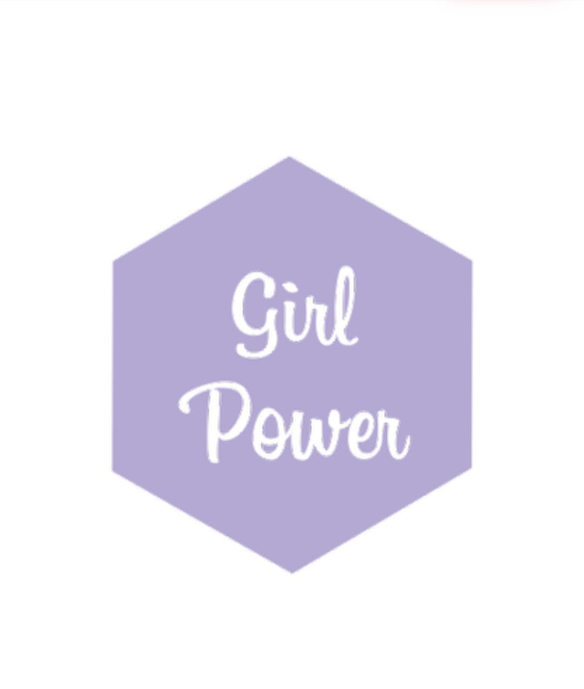

  

## :pencil: Table of Contents
- [Description](#description)
- [Used technologies](#used_technologies)
- [Team members](#team_members)
- [Presentation and Documentation](#documentation)
	
## :book: Description 
 
 The main goal of our project is game of C++
 
 

	*    Awesome algorithm 
	*    Easy to use and styled UI
	*    Overall good execution
	
## :computer: Used technologies 
- [Visual Studio](https://visualstudio.microsoft.com/) - Application
- [Word](https://www.microsoft.com/en-us/microsoft-365/word) - Documentation
- [PowerPoint](https://www.microsoft.com/en-us/microsoft-365/powerpoint) - Presentation
- [Excel](https://www.microsoft.com/en-us/microsoft-365/excel) - QA Documentation

## :busts_in_silhouette: Team members 
- [Стела Георгиева](https://github.com/SPGeorgieva21) - Scrum Trainer 
- [Александра Желева](https://github.com/AMZheleva21) - Front-End Developer
- [Мария Колева](https://github.com/MVKoleva21) - Back-End Developer
- [Жасмина Вълкова](https://github.com/ZIValkova21) - QA Engineer

## :clipboard: Presentation and Documentation 
+ [Presentation](https://github.com/SPGeorgieva21/Girl-power/blob/main/Documents/Presentation.pptx)
+ [Documentation](https://github.com/SPGeorgieva21/Girl-power/blob/docs/Documents/Documentation.docx)
+ [QA Documentation](https://github.com/SPGeorgieva21/Girl-power/blob/main/Documents/QA%20Documentation.xlsx)
